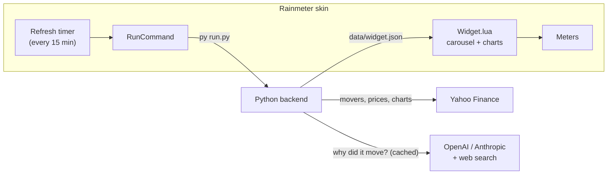

# AI Stock News for Rainmeter

A desktop widget for [Rainmeter](https://www.rainmeter.net/) that finds the day's
biggest stock moves, has an AI search the web to explain **why** each stock moved,
and rotates through the explanations with a live intraday chart for each company. A
sidebar shows the S&P 500, Dow Jones and Nasdaq.

Bring your own AI key: **OpenAI** and **Anthropic** are both supported. It's the
only key you need.

## Features

- **"Why did it move?" carousel.** For each stock, the AI runs a web search and writes
  a headline, a 2-3 sentence explanation, a sentiment tag, and a link to its source.
- **Biggest movers or your watchlist.** By default the widget shows the day's top US
  gainers and losers. You can list your own tickers instead.
- **Chart for every story.** Each story shows the company's intraday price, the
  day's change, and a sparkline with the previous close marked.
- **Market sidebar.** S&P 500, Dow Jones and Nasdaq cards with live change and charts.
- **Your choice of AI.** Switch between OpenAI and Anthropic, and pick any model, in
  one settings file.
- **Controlled costs.** Each stock is researched once per trading session after
  the close, and at most every 2 hours while the market is open. Prices and charts
  refresh every 15 minutes without calling the AI.
- **Real links only.** A source link is shown only if it came from the AI's search
  results, so made-up URLs never appear.
- **Built to fail gracefully.** If an API is down, the widget keeps the last good
  stories on screen and tells you what went wrong when you hover the status text.
- **Nothing extra to install.** The backend uses only the Python standard library.
- **Controls.** Hover to pause the carousel, click the arrows to move between
  stories, and click a headline to open the source article.

## Requirements

| Requirement    | Notes                                                                                   |
| -------------- | --------------------------------------------------------------------------------------- |
| Windows 10/11  | Rainmeter is Windows-only.                                                              |
| Rainmeter 4.5+ | [Download](https://www.rainmeter.net/). Includes the RunCommand plugin this skin uses.  |
| Python 3.9+    | [python.org](https://www.python.org/downloads/windows/). No packages needed.            |
| AI API key     | [OpenAI](https://platform.openai.com/api-keys) or [Anthropic](https://console.anthropic.com/settings/keys), with web search available on your account. |

Stock lists, prices and charts come from Yahoo Finance's public endpoints and need no key.

## Installation

### Option 1: `.rmskin` installer (recommended)

1. Install Python from [python.org](https://www.python.org/downloads/windows/). The
   default options install the `py` launcher, which the widget uses.
2. Download the latest `AIStockNews_x.y.z.rmskin` from the
   [Releases](../../releases) page and double-click it.
3. The widget loads showing **Setup required**. Continue to [Configuration](#configuration).

### Option 2: from source

```powershell
git clone https://github.com/gstarr96/stockswidget.git
cd stockswidget
.\tools\install-dev.ps1
```

`install-dev.ps1` links the repo's `Skins\AIStockNews` folder into your Rainmeter
Skins folder and loads the widget.

## Configuration

Right-click the widget and choose **Edit settings (API keys, AI provider)**. This opens
`%APPDATA%\AIStockNewsWidget\config.ini`, which is created on first run:

```ini
[stocks]
watchlist =                  ; blank = biggest movers, or e.g. AAPL, NVDA, TSLA
count = 5

[ai]
provider = openai            ; or: anthropic
openai_api_key = sk-...
openai_model = gpt-5-mini
anthropic_api_key =
anthropic_model = claude-haiku-4-5
summary_refresh_minutes = 120
```

Save the file, then right-click the widget and choose **Refresh now**.

| Setting                        | Default            | Description                                                      |
| ------------------------------ | ------------------ | ---------------------------------------------------------------- |
| `[stocks] watchlist`           | blank              | Tickers to follow. Blank shows the day's biggest gainers and losers. |
| `[stocks] count`               | `5`                | Stocks in the carousel (1-10).                                   |
| `[ai] provider`                | `openai`           | `openai` or `anthropic`.                                         |
| `[ai] openai_model`            | `gpt-5-mini`       | Any OpenAI model that supports the web search tool.              |
| `[ai] anthropic_model`         | `claude-haiku-4-5` | Any Claude model that supports the web search tool.              |
| `[ai] summary_refresh_minutes` | `120`              | While the market is open, the minimum minutes before a stock is researched again. |
| `[charts] interval`            | `5m`               | Chart resolution: `1m`, `2m`, `5m`, `15m` or `30m`.              |

A blank key falls back to the `OPENAI_API_KEY` or `ANTHROPIC_API_KEY` environment
variable.

### Appearance and behavior

Right-click the widget and choose **Edit appearance** to open
`@Resources\Variables.inc`. There you can change colors, fonts, sizes, how often the
widget refreshes (`RefreshMinutes`), how long each story stays on screen
(`SlideSeconds`), and which Python command to run (`Python`). Refresh the skin after
saving.

## How it works



1. On a timer, the skin runs the Python backend in a hidden window through the
   RunCommand plugin.
2. The backend takes your watchlist, or Yahoo's lists of the day's top gainers and
   losers, and fetches each stock's intraday chart and the three indices.
3. For each stock it hasn't recently researched, the backend asks your AI provider
   to search the web and explain the move, running up to three stocks at once. The
   model must answer in strict JSON, and the source link is checked against the
   search results.
4. Everything is written to `data/widget.json` atomically. The format is documented
   in [docs/data-format.md](docs/data-format.md). When the backend exits,
   `Widget.lua` reloads the file, draws the charts as Rainmeter Shape paths, and
   rotates the carousel.

## Privacy and costs

- Your API key is stored in plain text in `%APPDATA%\AIStockNewsWidget\config.ini`
  on your own PC, and is sent only to the provider it belongs to.
- The AI provider receives only the company name, ticker, price move and date. It
  then runs its own web searches.
- Web search is billed by your AI provider, per search plus the tokens used to read
  results. With the defaults (5 stocks, a small model, re-research every 2 hours
  during market hours), expect a few dozen searches on a trading day. That is
  usually well under a dollar, but check your provider's current pricing. To spend
  less, lower `count` or raise `summary_refresh_minutes`.

## Troubleshooting

| Symptom                               | Fix                                                                                     |
| ------------------------------------- | --------------------------------------------------------------------------------------- |
| **Setup required**                    | Add your key via **Edit settings**, then choose **Refresh now**.                        |
| **Python not found**                  | Install Python, or set `Python=` in `Variables.inc` to `python` or the full path to `python.exe`. |
| **Update failed (hover for details)** | Hover the status text for the reason. Right-click > **Open log** for full details.       |
| Rejected key or unknown model         | Check the key and the model name in `config.ini`. The model must support web search.    |
| Anthropic web search errors           | An organization admin may need to enable web search in the Anthropic Console.            |
| Index cards show `--`                 | Yahoo Finance was unreachable. The widget retries on the next refresh.                  |

Run the backend by hand to see everything it does:

```powershell
cd "$env:USERPROFILE\Documents\Rainmeter\Skins\AIStockNews\@Resources\backend"
py run.py --verbose --print
```

## Development

### Project layout

```text
stockswidget/
├── Skins/AIStockNews/            # Everything that ships in the .rmskin
│   ├── AIStockNews.ini           # Skin layout, meters and measures
│   └── @Resources/
│       ├── Variables.inc         # User-editable appearance and behavior
│       ├── config.example.ini    # Template copied to %APPDATA% on first run
│       ├── Scripts/
│       │   ├── Widget.lua        # Carousel, rendering and chart drawing
│       │   └── json.lua          # Minimal JSON decoder
│       └── backend/
│           ├── run.py            # Entry point called by the skin
│           └── stocknews/        # Python package (standard library only)
│               ├── cli.py        # Argument parsing, logging, error reporting
│               ├── config.py     # Paths and settings
│               ├── pipeline.py   # Orchestrates one refresh, plus the research cache
│               ├── market.py     # Yahoo Finance movers, prices and charts
│               ├── research.py   # "Why did it move?" prompt and answer validation
│               ├── output.py     # widget.json construction and atomic writes
│               ├── charts.py     # Downsampling and normalization
│               ├── http.py       # urllib wrapper with retries
│               └── ai/           # Provider interface, OpenAI and Anthropic web search
├── tests/                        # pytest suite (no network access)
├── tools/
│   ├── install-dev.ps1           # Link the skin into Rainmeter for development
│   └── build-rmskin.ps1          # Build dist/AIStockNews_<version>.rmskin
├── docs/                         # Data format and images
└── .github/workflows/            # CI (lint, tests, Lua syntax, packaging) and releases
```

### Setup

```powershell
py -m venv .venv
.\.venv\Scripts\Activate.ps1
pip install -r requirements-dev.txt
.\tools\install-dev.ps1
```

### Checks

```powershell
ruff check .
ruff format .
pytest
```

All tests use fakes, so they never hit the network or spend API credits.

### Adding an AI provider

1. Create `stocknews/ai/<name>_provider.py` with a subclass of `AIProvider` that
   implements `research(system, prompt) -> AIReply`. It should run a web search and
   return the answer text plus the cited URLs.
2. Register it in `stocknews/ai/__init__.py`, and add it to `PROVIDER_LABELS` and
   the settings in `stocknews/config.py`.
3. Document its settings in `config.example.ini` and in this README.

### Releasing

1. Bump `__version__` in `stocknews/__init__.py` and `Version` in the skin's
   `[Metadata]`, then update `CHANGELOG.md`.
2. Tag and push, for example `git tag v0.2.0 && git push --tags`. The release
   workflow builds the `.rmskin` and attaches it to a GitHub release.

To build a package locally, run `.\tools\build-rmskin.ps1`. The output goes to `dist\`.

## Contributing

Issues and pull requests are welcome. Please run `ruff check .`, `ruff format .` and
`pytest` before opening a PR, and add tests for any backend change.

## Disclaimer

This project is for information and entertainment only and is **not financial
advice**. AI explanations can be wrong or incomplete, so check the linked source
before acting on anything. Market data may be delayed. Yahoo Finance's endpoints are
unofficial and may change without notice. Use of OpenAI, Anthropic and Yahoo data is
subject to their respective terms.

## License

[MIT](LICENSE)
